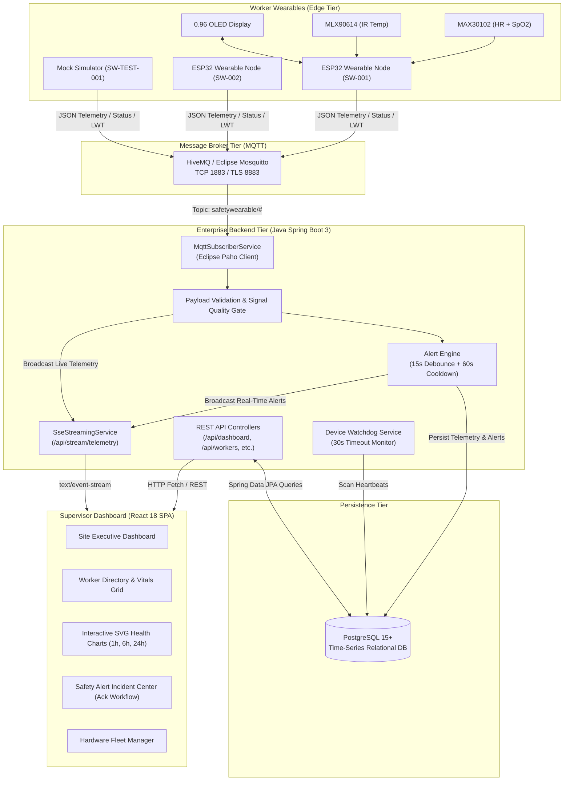

# P_174 — IoT-Based Occupational Safety & Health Monitoring System

[](#system-architecture)
[](firmware/SafetyWearable_MQTT/SafetyWearable_MQTT.ino)
[-orange.svg)](docs/MQTT_PROTOCOL.md)
[](backend/)
[](docs/DATABASE.md)
[-61dafb.svg)](frontend/)

An industrial-grade IoT platform engineered to monitor construction workers' vital signs in real-time, detect environmental heat stress, physical exhaustion, and hypoxia, and deliver early safety warnings to site supervisors.

> [!NOTE]
> **Health & Safety Prototype Notice:** This system is an occupational safety monitoring prototype designed for environmental hazard mitigation and risk triage. It is **not** a certified medical diagnostic device.

---

## 1. Problem Statement & Industrial Context

Civil construction workers across high-heat environments (such as peak summer in the Delhi-NCR region, where temperatures exceed **42°C–46°C**) are subject to severe occupational hazards:
* **Exertional Heat Stroke & Hyperthermia:** Elevated core body temperature leading to sudden collapse.
* **Cardiovascular Overexertion:** Prolonged heart rates $> 110\text{ BPM}$ while carrying structural rebar or operating heavy machinery.
* **Respiratory Hypoxia:** Unnoticed arterial oxygen drops ($< 92\%$) in confined underground excavation pits.

P_174 replaces disconnected consumer fitness trackers and single-user mobile apps with a **centralized, multi-tenant industrial safety platform**.

---

## 2. System Architecture



---

## 3. Technology Stack

* **Edge Wearable:** ESP32 (WROOM-32 38-Pin), MAX30102 PPG sensor, MLX90614 IR thermometer, 0.96" SSD1306 OLED, Arduino C++ framework.
* **Message Transport:** MQTT v3.1.1 (HiveMQ Cloud / Community Edition, Eclipse Mosquitto).
* **Enterprise Backend:** Java 17+, Spring Boot 3.2.4, Spring Data JPA, Eclipse Paho MQTT client, Jackson.
* **Database:** PostgreSQL 15+ with B-Tree composite time-series indexing.
* **Frontend:** React 18, Vite 5, Responsive CSS Design System, Dynamic SVG time-series visualizers, Server-Sent Events (SSE).
* **Tooling:** Docker & Docker Compose, Python/Node mock telemetry generators.

---

## 4. Repository Structure

```text
c:\Users\ajay7\Downloads\hcl_project\
├── backend/                             # Java Spring Boot 3 Backend
│   ├── pom.xml                          # Maven build dependencies
│   ├── Dockerfile                       # Multi-stage container build
│   └── src/
│       ├── main/java/com/project/safetywearable/
│       │   ├── controller/              # REST & SSE Controllers
│       │   ├── service/                 # Telemetry, AlertEngine, Watchdog, Worker services
│       │   ├── repository/              # Spring Data JPA Repositories
│       │   ├── entity/                  # JPA Entities (Device, Worker, HealthReading, Alert)
│       │   ├── dto/                     # Inbound/Outbound Data Transfer Objects
│       │   ├── mqtt/                    # Eclipse Paho MQTT Subscriber
│       │   ├── config/                  # CORS and Spring configuration
│       │   └── exception/               # Global REST exception handlers
│       ├── main/resources/
│       │   ├── application.properties   # Production configuration
│       │   ├── schema.sql               # PostgreSQL DDL
│       │   └── data.sql                 # Baseline seed devices and workers
│       └── test/java/                   # Unit & Integration Tests (AlertEngine, Deserialization)
├── frontend/                            # React 18 Supervisor Web Application
│   ├── package.json                     # NPM dependencies (Vite, React 18)
│   ├── vite.config.js                   # Reverse proxy configuration
│   ├── Dockerfile & nginx.conf          # Container deployment with Nginx
│   └── src/
│       ├── components/                  # Navbar, SummaryCards, WorkerCard, VitalsChart, Tables
│       ├── pages/                       # Dashboard, Workers, WorkerDetail, Alerts, Devices
│       ├── services/                    # REST API & SSE EventSource client
│       └── styles/index.css             # Industrial high-contrast styling
├── firmware/
│   ├── SafetyWearable_MQTT/             # Production Enterprise MQTT Firmware (New)
│   │   └── SafetyWearable_MQTT.ino
│   ├── SafetyWearable_Phase2/           # Preserved Offline Baseline Sketch
│   └── SafetyWearable_Phase3/           # Preserved Legacy Blynk Sketch
├── tools/                               # Simulation & Testing Utilities
│   ├── mock_mqtt_publisher.py           # Python Scenario Simulator (Heat stress, hypoxia, exhaustion)
│   └── mock_mqtt_publisher.js           # Node.js Simulator
├── docs/                                # Engineering Documentation
│   ├── PROJECT_AUDIT.md                 # Migration audit and problem analysis
│   ├── ARCHITECTURE.md                  # Comprehensive system architecture
│   ├── HARDWARE_VERIFICATION.md         # Power dropout warning and board LDO analysis
│   ├── MQTT_PROTOCOL.md                 # Topic contracts and payload schemas
│   ├── DATABASE.md                      # PostgreSQL schema & index design
│   ├── API.md                           # REST & SSE endpoint contracts
│   ├── FRONTEND.md                      # UI/UX specifications
│   ├── TESTING.md                       # Test suites and simulation protocol
│   └── DEPLOYMENT.md                    # Docker and native startup guide
├── docker-compose.yml                   # One-click Postgres, Mosquitto, Backend & Frontend stack
├── IMPLEMENTATION_STATUS.md             # Complete component delivery matrix
└── .env.example                         # Environment variables template
```

---

## 5. MQTT Messaging Protocol

All topics are namespaced under `safetywearable/{deviceId}/`:

| Topic | Direction | QoS | Retained | Purpose |
| :--- | :--- | :--- | :--- | :--- |
| `safetywearable/{deviceId}/telemetry` | Edge ──► Backend | 0 | No | Periodic vitals (5s): HR, SpO2, Temp, Signal Quality |
| `safetywearable/{deviceId}/status` | Edge ──► Backend | 1 | Yes | Node connectivity lifecycle & Last Will Testament (LWT) |
| `safetywearable/{deviceId}/alert` | Edge ──► Backend | 1 | No | Edge-detected emergency threshold warnings |
| `safetywearable/{deviceId}/command` | Backend ──► Edge | 1 | No | Configuration and remote reboot commands |

### Telemetry JSON Payload Contract:
```json
{
  "deviceId": "SW-001",
  "heartRate": 96,
  "heartRateValid": true,
  "spo2": 97,
  "spo2Valid": true,
  "temperature": 37.2,
  "temperatureValid": true,
  "battery": 82,
  "signalQuality": "VALID",
  "timestamp": "2026-09-30T09:12:00Z"
}
```

> [!IMPORTANT]
> **Data Integrity:** When optical contact is detached, the firmware emits JSON `null` for `heartRate` and `spo2` with `signalQuality: "NO_CONTACT"`. It **never** broadcasts fake zero values.

---

## 6. Configurable Safety Alert Engine

Safety limits are non-diagnostic project thresholds configurable via `application.properties`:
* `safety.threshold.heart-rate.max`: `110` BPM (Cardiovascular Exertion / Fatigue)
* `safety.threshold.spo2.min`: `92` % (Hypoxia / Respiratory Distress)
* `safety.threshold.temperature.max`: `38.0` °C (Environmental Heat Stroke Warning)

### Anti-Spam & False-Positive Mitigation:
1. **15-Second Persistence Debounce:** Transient motion artifacts (hammering, bar bending) do not trip alarms. An abnormal reading must persist for 15 consecutive seconds before an alert is confirmed.
2. **60-Second Cooldown:** Prevents alert notification floods while a worker's vitals remain elevated.
3. **Supervisor Acknowledgment:** Every incident record can be formally acknowledged with supervisor ID and remediation notes (e.g. "Worker moved to shaded hydration station").

---

## 7. Quickstart Deployment Guide

### Option 1: One-Click Docker Compose (Recommended)
```bash
# 1. Clone or navigate to the project directory
cd c:\Users\ajay7\Downloads\hcl_project

# 2. Launch PostgreSQL, Mosquitto, Spring Boot, and React
docker-compose up --build -d

# 3. Access interfaces:
#    React Dashboard: http://localhost:3000
#    Spring Boot API: http://localhost:8080/api/dashboard/summary
#    MQTT Broker:     localhost:1883
```

### Option 2: Native Manual Launch

#### 1. Database Setup
```sql
-- Connect to PostgreSQL and create database
CREATE DATABASE safety_wearable_db;
-- Execute schema and seed data
\i backend/src/main/resources/schema.sql
\i backend/src/main/resources/data.sql
```

#### 2. Launch Spring Boot Backend
```bash
cd backend
mvn clean spring-boot:run
```

#### 3. Launch React Frontend
```bash
cd frontend
npm install
npm run dev
# Dashboard opens at http://localhost:5173
```

#### 4. Run Telemetry Simulator (No Hardware Required)
```bash
# Using Python:
python tools/mock_mqtt_publisher.py --scenario heat_stress

# Or using Node.js:
node tools/mock_mqtt_publisher.js SW-TEST-001 normal
```

#### 5. Flash ESP32 Hardware (When Physical Node is Available)
1. Open [`firmware/SafetyWearable_MQTT/SafetyWearable_MQTT.ino`](file:///c:/Users/ajay7/Downloads/hcl_project/firmware/SafetyWearable_MQTT/SafetyWearable_MQTT.ino) in Arduino IDE.
2. Set your Wi-Fi SSID, password, and MQTT Broker IP address.
3. Select board **ESP32 Dev Module** and flash via USB.

---

## 8. REST API Reference

| Method | Endpoint | Description |
| :--- | :--- | :--- |
| `GET` | `/api/dashboard/summary` | Executive site metrics (Total, Online, Active Alerts, Warnings) |
| `GET` | `/api/workers` | Complete worker directory with live vitals and safety state |
| `GET` | `/api/workers/{id}` | Worker detailed profile and linked device metadata |
| `GET` | `/api/devices` | Provisioned hardware inventory and battery levels |
| `GET` | `/api/readings/{deviceId}` | Historical time-series telemetry (supports `?limit=100`) |
| `GET` | `/api/alerts` | Safety incidents log (supports `?acknowledged=false`) |
| `POST`| `/api/alerts/{id}/acknowledge` | Supervisor acknowledgment workflow |
| `GET` | `/api/stream/telemetry` | Real-time Server-Sent Events (SSE) telemetry feed |

---

## 9. Hardware Verification Warnings & Ruggedization

* **Power Dropout Warning:** Inspect your ESP32 board regulator. Standard AMS1117 regulators have a 1.1V dropout and will brownout when directly connected to a 3.7V LiPo on VIN. Use an **MT3608 boost converter to 5.0V** or an ultra-low dropout LDO (**MCP1700-3302E**). Detailed schematics are in [`docs/HARDWARE_VERIFICATION.md`](file:///c:/Users/ajay7/Downloads/hcl_project/docs/HARDWARE_VERIFICATION.md).
* **Rugged Enclosure:** Use dual-extrusion **ASA (rigid outer shell)** and **TPU 95A (skin contact gasket)**. Ensure MLX90614 is thermally isolated from ESP32 board heat by a 3mm silicone aerogel partition wall.

---

## 10. Limitations & Future Roadmap

* [ ] **Physical Sensor Field Testing:** Validation against CE-certified pulse oximeters and tympanic thermometers pending on-site construction hardware trials.
* [ ] **Fuel Gauge Circuitry:** Battery telemetry currently broadcasts `null` until hardware voltage divider (e.g. 100kΩ/100kΩ on GPIO 34) is soldered.
* [ ] **Edge Machine Learning:** Future phases can introduce TinyML anomaly detection on the ESP32 (e.g. IMU motion-gating and heat strain index calculation).
