# Architecture Specification: P_174 — Occupational Safety & Health Monitoring System

**Project:** P_174 — Occupational Safety & Health Monitoring System  
**Document Ref:** `docs/ARCHITECTURE.md`

---

## 1. System Context & Overview

The P_174 system is an end-to-end IoT platform engineered to detect physiological fatigue, hyperthermia, and respiratory hypoxia among industrial and civil construction workers. The platform decouples edge data acquisition, reliable message routing, persistence, alerting, and supervisor visualization into isolated tiers.

```mermaid
flowchart TD
    subgraph Wearable [Worker Wearable Layer]
        ESP32[ESP32 Wearable Node]
        MAX[MAX30102 PPG Sensor] -->|I2C 0x57| ESP32
        MLX[MLX90614 IR Thermometer] -->|I2C 0x5A| ESP32
        OLED[SSD1306 0.96 OLED] <-->|I2C 0x3C| ESP32
    end

    subgraph Messaging [MQTT Broker Layer]
        BROKER[HiveMQ / Mosquitto MQTT Broker\nTCP 1883 / TLS 8883]
    end

    subgraph Backend [Java Spring Boot Service]
        SUBSCRIBER[MQTT Inbound Subscriber]
        VAL[Payload & Signal Validator]
        ENG[Safety Alert & Cooldown Engine]
        API[Spring Boot REST & SSE Controller]
        OFFLINE[Device Offline Heartbeat Monitor]
    end

    subgraph Storage [Database Layer]
        PG[(PostgreSQL 15+\nTime-Series Indexed Relational DB)]
    end

    subgraph Frontend [Supervisor UI Layer]
        REACT[React 18 Dashboard SPA\nResponsive UI / Historical Charts]
    end

    ESP32 -->|Wi-Fi / JSON over MQTT| BROKER
    BROKER -->|Topic: safetywearable/#| SUBSCRIBER
    SUBSCRIBER --> VAL
    VAL --> ENG
    ENG -->|JPA / Hibernate| PG
    OFFLINE -->|Status Updates| PG
    API <-->|Spring Data JPA| PG
    API -->|SSE / REST /api/*| REACT
```

---

## 2. Component Responsibilities

### 2.1 Worker Wearable (ESP32)
* **Sampling Rate:** Continuous sliding window acquisition (100 raw samples at 100sps with 4x hardware averaging = 25 effective sps).
* **Signal Quality Gate:** Categorizes readings into `VALID`, `NO_CONTACT`, `LOW_SIGNAL`, `MOTION_DEGRADED`.
* **Identity:** Broadcasts hardware Device ID (e.g., `SW-001`). No personal worker data is embedded into the firmware.
* **Local Feedback:** Real-time 0.96" OLED display reflecting local vitals, Wi-Fi status, and MQTT connection state.
* **Fail-Safe Transport:** Transmits telemetry every 5 seconds. If Wi-Fi drops, it maintains local display and reconnects non-blockingly.

### 2.2 MQTT Broker (HiveMQ / Mosquitto)
* **Decoupled Messaging:** Provides asynchronous pub/sub messaging.
* **QoS Levels:**
  * Telemetry messages: QoS 0 (high throughput, non-critical loss).
  * Safety alert messages: QoS 1 (at least once delivery).
  * Device status & LWT (Last Will and Testament): QoS 1 with Retained flag.

### 2.3 Java Spring Boot Backend
* **Inbound Telemetry Ingestion:** Subscribes to `safetywearable/+/telemetry` and `safetywearable/+/alert`.
* **Centralized Alert Engine:**
  * Eliminates firmware-dependent hardcoded threshold lock-in.
  * Evaluates configurable safety limits:
    * High Heart Rate: $> 110\text{ BPM}$
    * Low SpO2: $< 92\%$
    * High Body Temperature: $> 38.0^\circ\text{C}$
  * Implements a **15-second persistence confirmation window** to reject motion transients.
  * Implements a **60-second alert cooldown** to prevent notification flooding.
* **Device Heartbeat Watchdog:** Background scheduled task polling every 10 seconds; marks devices `OFFLINE` if no packet received within 30 seconds.
* **REST & Streaming API:** Exposes clean JSON DTO endpoints and Server-Sent Events (SSE) for zero-latency dashboard refresh.

### 2.4 PostgreSQL Database
* **Relational Integrity:** Clean foreign-key relationships separating physical hardware (`devices`), human operators (`workers`), continuous telemetry (`health_readings`), and logged emergency incidents (`alerts`).
* **Performance Indexing:** Composite B-tree indexes on `(device_id, timestamp DESC)` and `(worker_id, timestamp DESC)` to power instantaneous historical charting.

### 2.5 React Full-Stack Frontend
* **Supervisor Executive Dashboard:** Summary KPI cards (Total Workers, Devices Online, Active Alerts, Warning Status).
* **Live Worker Grid:** Real-time cards displaying vitals, connection badges, battery indicator, and signal quality state.
* **Worker Deep Dive:** Detailed historical time-series analytics (BPM, SpO2%, Temp °C) with configurable zoom (1h, 6h, 24h).
* **Alert Incident Center:** Acknowledgment workflow for safety supervisors.
* **Device Fleet Manager:** Asset tracker mapping hardware serial numbers to workers.
